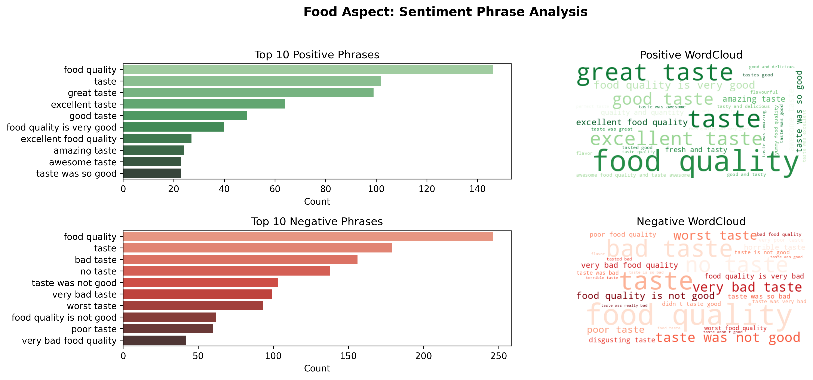
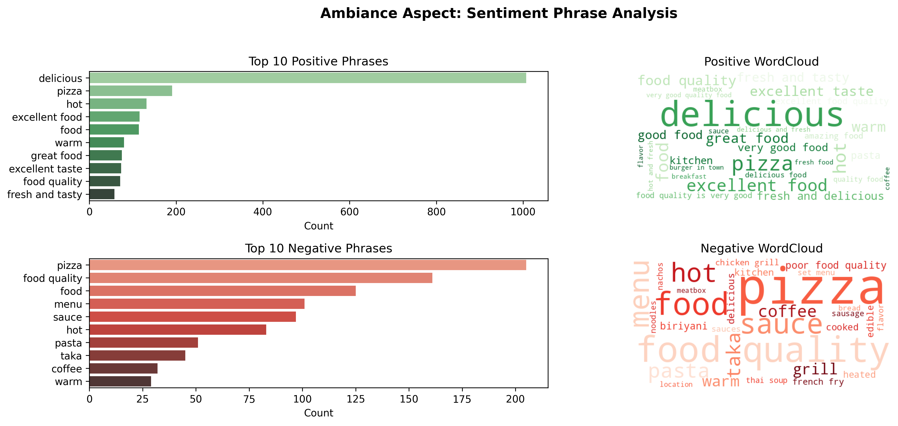
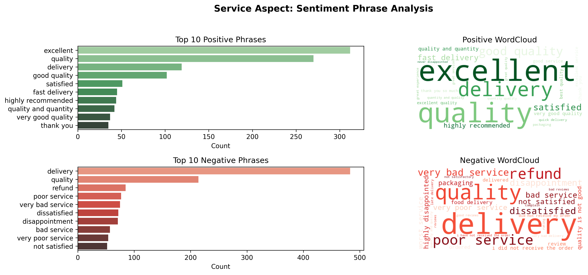
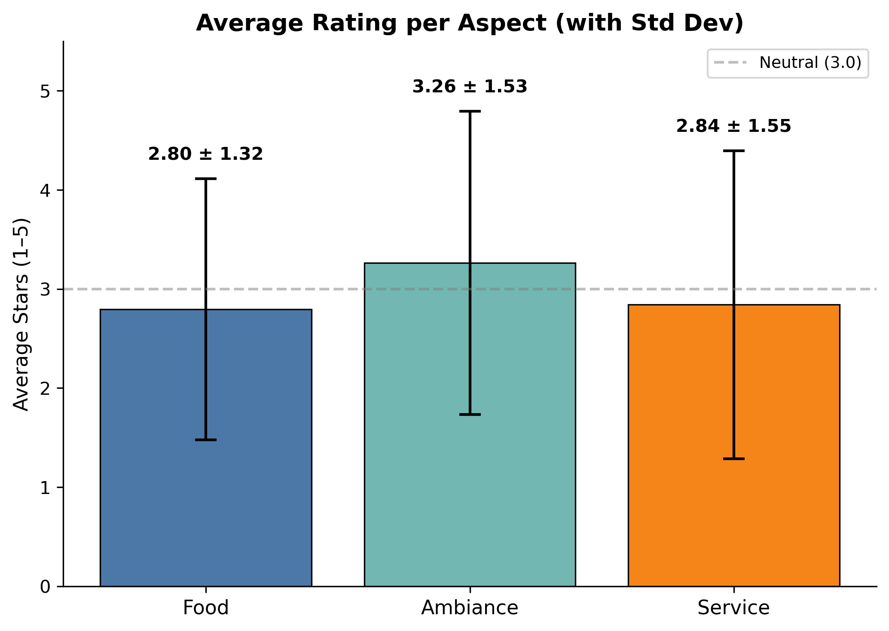
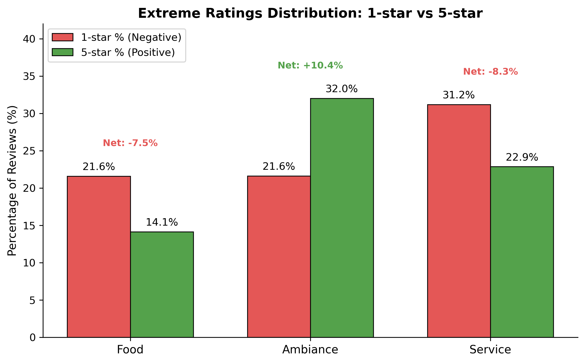
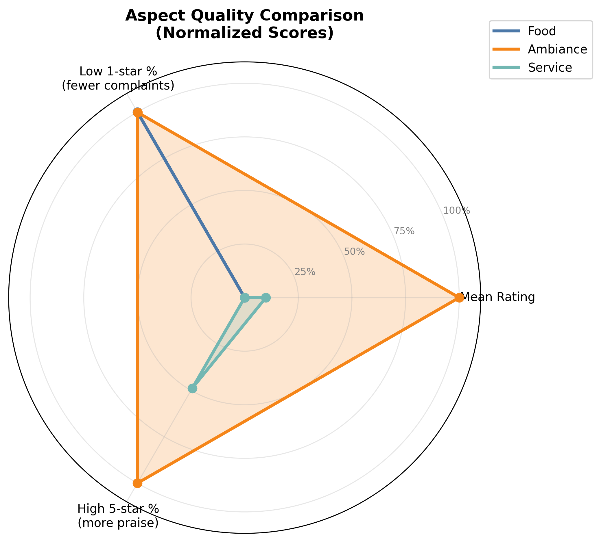

# User Review Analysis Report

This document summarizes the findings from the sentiment analysis of user reviews, focusing on three main aspects: **Food**, **Ambiance**, and **Service**.

---

## 1. Sentiment Label Distribution

Based on the TinyRoBERTa model's sentiment predictions, we observe distinct patterns across the three aspects.

### **Food**
* Sentiment distribution shows a **clear negative bias**.
* **3-star reviews dominate at 29.6%**, indicating neutral experiences are most common.
* 1-star (21.6%) and 2-star (20.1%) combined account for **41.7%** — showing significant dissatisfaction.
* **5-star reviews are the lowest at 14.1%**, confirming weak positive sentiment.
* The descending trend line visually confirms declining satisfaction as ratings improve.

### **Ambiance**
* Ambiance displays a **strong positive skew** — the only aspect with net positive sentiment.
* **5-star reviews dominate at 32.0%**, far exceeding other ratings.
* 1-star reviews are significant (21.6%), but the **net sentiment is positive (+10.4%)**.
* 2-star reviews are notably low (10.7%), creating a U-shaped distribution (polarized but positive-leaning).

### **Service**
* Service sentiment is **highly polarized** with extreme ratings dominating.
* **1-star reviews are the highest at 31.2%** — the strongest negative signal across all aspects.
* **5-star reviews are second-highest at 22.9%**, but still create a **net negative sentiment (-8.3%)**.
* This bimodal distribution indicates **inconsistent service quality** — customers either love it or hate it.

### **Overall Insights**
* **Ambiance is the only strong point** — customers consistently appreciate the atmosphere.
* **Service is the weakest link** — the highest 1-star percentage (31.2%) makes it the primary pain point.
* **Food quality is mediocre** — neutral and negative reviews dominate.
* All three aspects show **high 1-star percentages (21-31%)**, indicating a substantial portion of customers have strongly negative experiences.

---

## 2. Quantitative Sentiment Summary

### Food
- **Lowest average rating at 2.80** — well below neutral (3.0).
- **Net sentiment: -7.5%** (14.1% 5-star vs 21.6% 1-star).
- **Insight:** Food quality is the weakest aspect with consistently poor performance.

### Ambiance
- **Highest average rating at 3.26** — the only aspect above neutral.
- **Net sentiment is +10.4%** (32.0% 5-star vs 21.6% 1-star).
- **Insight:** Ambiance is the strongest and most appreciated aspect.

### Service
- **Average rating of 2.84** — second-lowest.
- **Highest 1-star percentage at 31.2%**.
- **Standard deviation of 1.55** is the highest, confirming extreme polarization.
- **Insight:** Service quality is highly inconsistent.

### Overall
- **Ambiance is the clear winner**.
- **Service is the most problematic**.
- **Food is weak and stagnant**.

---

## 3. Key Phrase Analysis

### Food
- **Positive phrases**: "food quality", "taste", "great taste".
- **Negative phrases**: "food quality", "taste", "bad taste", "no taste".
- **Insight**: Taste consistency is the single most critical factor.

### Ambiance
- **Aspect leakage detected**: Top phrases are almost entirely **food-related** (e.g., "delicious", "pizza").
- **Insight**: Phrase-level analysis for Ambiance is unreliable due to model confusion; rely on sentiment distribution instead.

### Service
- **Positive phrases**: "excellent", "quality", "delivery".
- **Negative phrases**: "delivery", "quality", "refund", "poor service".
- **Insight**: Service sentiment is **delivery-dominated**. "Delivery" appears 4x more in negative reviews than positive ones.

---

## 4. Aspect-Level Rating Summary

### Visualizations

**Average Rating per Aspect (with Std Dev)**

**Extreme Ratings Distribution: 1-star vs 5-star**

**Aspect Quality Comparison (Radar Chart)**

### Summary
* **Ambiance** leads across all dimensions: highest mean rating, lowest complaint rate, and strongest positive feedback.
* **Food** performs moderately but remains held back by taste-related complaints.
* **Service** ranks lowest overall, driven by many 1-star delivery/service issues.

---

## 5. Model Comparison (TinyRoBERTa vs BERT)

### Overall Pattern
Across all three aspects, TinyRoBERTa tends to extract **longer, more contextual spans**, while BERT consistently returns **short, sentiment-focused phrases**.

### Food
* **Exact Match:** ~44%
* Mostly consistent polarity. Disagreements occur when TinyRoBERTa extracts full descriptions vs BERT's compact words.

### Ambiance
* **Exact Match:** ~12% (lowest)
* High noise due to aspect leakage and inconsistent extraction.

### Service
* **Exact Match:** ~40%
* Strong disagreement on **span length**. Delivery-related content dominates.

### Key Insight
* **BERT is more stable and interpretable** for aspect-level sentiment phrases.
* **TinyRoBERTa behaves more like a QA span retriever**, causing inconsistent phrase boundaries.
